> **Status**: This guide is in progress.

This guide walks you through designing an **AI Chief of Staff**—an _AI version of n8n_—powered by Cortex. Instead of only _answering_ questions, this assistant can **_take actions_** across every app in your workspace by selecting and executing the correct function at the right time.

> **Note**: All code examples in this guide are for demonstration purposes. They show the concepts and patterns you can use when building your own Glean-like application with Cortex APIs. Follow the [actual API documentation](https://docs.usecortex.ai/api-reference/introduction) to adapt these examples to your specific use case, technology stack, and requirements.

> **Goal**: Let any agent ask Cortex _"What should I do next?"_ and receive a structured function call (plus parameters) that your execution layer can run.

## The "Second Brain" Concept

Think of Cortex as your AI agent's **second brain**—a reasoning layer that transforms natural language requests into precise function calls. Your primary AI agent handles conversation and context, while Cortex becomes the **function selection oracle** that knows:

- **Which** function to call for any given task
- **When** multiple functions need to be chained together
- **How** to adapt based on user preferences and historical patterns
- **Why** certain approaches work better for specific users or scenarios

This separation of concerns means your AI agent doesn't need to maintain complex decision trees or hardcoded workflows. Instead, it can focus on understanding user intent while delegating the "how to execute" decisions to Cortex's reasoning engine.

### The Power of Intelligent Function Routing

Unlike traditional automation platforms where you build rigid if-then workflows, Cortex enables **dynamic function routing**. Your AI agent can say:

> _"The user wants to 'prepare for tomorrow's client meeting'—what should I do?"_

Cortex responds with context-aware suggestions:

- Check calendar for meeting details
- Pull recent communication threads with that client
- Generate briefing notes from CRM data
- Set up the meeting room technology
- Send agenda reminders to participants

The same request from different users might yield different function sequences based on their roles, preferences, and historical patterns—all automatically determined by Cortex's reasoning layer.

## Why an AI Chief of Staff?

1. **Unified Automation**: Replace brittle manual workflows with a single reasoning layer.
2. **Context-Aware**: Decisions include user preferences, company policies, and real-time data.
3. **Incremental Roll-Out**: Start with read-only automations, graduate to high-impact write actions.
4. **Agent Enhancement**: Transform any AI agent into an action-capable assistant without rebuilding core logic.

---

## Architecture Overview

```mermaid
graph LR
    A["User / Agent"] -->|"ask(task)"| B["Action Orchestrator<br/>• Policy Engine<br/>• Retry / Logging<br/>• Auth Vault<br/>• Function Cache"]
    B -->|"call(fn)"| C["Workspace Apps<br/>(Slack, Jira …)"]
    D["Cortex"] -->|"function suggestions"| B
    B -->|"feedback / events / memories"| A
```



- **Action Orchestrator**: Your runtime that receives function suggestions from Cortex and executes them.
- **Cortex**: Stores **function definitions** & performs reasoning to decide _which_ function (if any) solves the task.
- **Workspace Apps**: Anything with an API—CRM, calendar, ticketing, HRIS.

---

## How Cortex Essential Features Enable This

### AI Memories for Function Learning

Cortex's **AI Memories** don't just remember user preferences—they learn **function effectiveness patterns**. When a user frequently chooses certain functions for specific types of tasks, Cortex builds a personalized "function preference profile." This means your AI agent gets smarter suggestions over time without any manual training.

**Example**: If Sarah always prefers Slack notifications over email for urgent updates, Cortex learns this pattern and automatically suggests `send_slack_message` instead of `send_email` for her urgent notifications.

### Multi-Step Reasoning for Complex Workflows

Simple tasks require one function call. Complex business processes require **orchestrated sequences**. Cortex's multi-step reasoning automatically decomposes requests like _"Onboard the new hire"_ into:

1. Create accounts across systems
2. Send welcome materials
3. Schedule orientation meetings
4. Assign equipment requests
5. Notify team members

Your AI agent makes one request to Cortex and receives a complete execution plan with dependency management built-in.

### Self-Improving Function Selection

As your function library grows and usage patterns emerge, Cortex's **self-improving** capabilities automatically optimize function selection. It learns which functions tend to succeed together, which ones cause errors in certain contexts, and how to adapt suggestions based on real-world outcomes.

This means your AI Chief of Staff becomes more reliable over time without manual tuning—it develops institutional knowledge about what works in your specific environment.

### Multi-Tenant Function Isolation

Different teams, departments, or customers need access to different function sets. Cortex's **multi-tenant** architecture ensures that your sales team's AI agent only sees sales-related functions, while the engineering team's agent has access to deployment and monitoring functions.

This isn't just about security—it's about **cognitive focus**. By limiting function scope per context, Cortex can make more precise recommendations without being overwhelmed by irrelevant options.

---

## Step 1 — Define & Register Functions

### 1.1 Function Schema

Cortex treats each callable as a **knowledge object**. The minimal schema:

```jsonc
{
  "id": "send_slack_message",
  "name": "Send a Slack message",
  "description": "Posts a message to a Slack channel on behalf of the user.",
  "parameters": {
    "type": "object",
    "properties": {
      "channel": {"type": "string", "description": "#channel or userId"},
      "text":    {"type": "string", "description": "Message body"},
      "thread_ts": {"type": "string", "description": "Optional thread"}
    },
    "required": ["channel", "text"]
  },
  "auth": {
    "oauth_provider": "slack",
    "scopes": ["chat:write"]
  }
}
```

### 1.2 Upload to Cortex

Use the _same_ `/upload/upload_app_sources` endpoint you already know—set `type: "function"`.

```js
await cortex.uploadBatch([
  {
    id: "send_slack_message",
    title: "Send a Slack message",
    type: "function",      // 👈 tells Cortex this is callable
    timestamp: new Date().toISOString(),
    content: { text: JSON.stringify(schema) },
    collections: ["automation", "slack"],
    meta: { permissions: ["workspace_admins"] }
  }
]);
```

> **Tip**: Keep function **descriptions** natural-language and goal-oriented—Cortex uses them during reasoning.

### 1.3 Versioning & Deprecation

Store new versions with `id: functionName_v2`. Mark old versions' `cortex_metadata.deprecated = true` so Cortex avoids suggesting them.

---

## Step 2 — Build the Action Orchestrator

The orchestrator bridges Cortex ↔ real APIs.

```ts
class Orchestrator {
  constructor(cortex, registry) {
    this.cortex = cortex;          // SDK wrapper
    this.registry = registry;      // Map<id, executeFn>
  }

  async handleTask(task, userContext) {
    // 1️⃣ Ask Cortex which function solves the task
    const suggestion = await this.cortex.functionSuggest(task, {
      userName: userContext.email,
      sessionId: userContext.sessionId,
      context: userContext.recentEvents
    });

    if (!suggestion.function_call) return { status: "noop" };

    // 2️⃣ Execute
    const exec = this.registry[suggestion.function_call.name];
    const result = await exec(suggestion.function_call.arguments);

    // 3️⃣ Optional: feed result back to Cortex for memory
    await this.cortex.logFunctionResult({
      functionId: suggestion.function_call.name,
      resultSummary: summarize(result)
    });

    return { status: "done", result };
  }
}
```

> **Notable Flags**
>
> - `auto_agent_routing`: Lets Cortex choose between _answering_ vs _acting_.
> - `multi_step_reasoning`: Enables plans like _"create Zoom, then email invite"_.

---

## Real-World Applications

### Customer Success Automation

**Scenario**: A customer submits a support ticket asking for a feature demo.

**Traditional Approach**: Support agent manually coordinates with sales, schedules demo, updates CRM, sends confirmations.

**AI Chief of Staff Approach**: Your AI agent tells Cortex _"Customer Jane from Acme Corp wants a demo of our new reporting feature."_

Cortex suggests:

1. `check_customer_tier` → Determines appropriate demo level
2. `find_available_demo_slots` → Checks AE calendar availability
3. `create_demo_meeting` → Books calendar event with zoom link
4. `update_crm_opportunity` → Logs demo request and scheduled date
5. `send_confirmation_email` → Notifies customer with details

All triggered by one natural language request, all personalized to Jane's account context.

### Executive Assistant Workflows

**Scenario**: CEO says _"Prepare for board meeting next Tuesday"_

Without hardcoding what "prepare" means, Cortex can suggest:

- `compile_kpi_dashboard` → Gather latest metrics
- `review_action_items` → Check previous meeting follow-ups
- `book_catering` → Arrange refreshments based on attendee count
- `send_agenda_reminder` → Notify board members 24 hours prior
- `prepare_presentation_materials` → Compile slide deck from templates

The beauty is that **each executive's "preparation" style is different**—Cortex learns these patterns through AI Memories and adapts accordingly.

### DevOps Incident Response

**Scenario**: Monitoring alert triggers: _"Database response time degraded"_

Your AI agent asks Cortex for the appropriate response. Based on severity, time of day, and historical patterns, Cortex might suggest:

**During business hours**:

1. `create_incident_ticket` → Log in tracking system
2. `notify_oncall_engineer` → Alert via PagerDuty
3. `scale_database_resources` → Auto-remediation attempt
4. `post_status_update` → Inform stakeholders

**During off-hours for minor issues**:

1. `log_incident_details` → Document for morning review
2. `monitor_for_escalation` → Set up enhanced alerting
3. `schedule_followup_review` → Add to next team standup

Same trigger, different responses based on learned patterns and context.

---

## Step 3 — Event & Trigger Model

Your Chief of Staff should react to:

1. **Direct Commands** – "Book me a 30-min call with Alice next week."
2. **Scheduled Jobs** – Daily stand-up summary at 9 AM.
3. **System Events** – New ticket in Jira → triage.

Create a thin wrapper per event source that forwards the _natural-language_ description to the orchestrator.

```bash
# Slack slash-command → cloud-function
/ai book meeting with @alice next tuesday
```

---

## Step 4 — Planning & Multi-Step Execution

Sometimes the task requires **multiple** calls.


1. **Plan Generation**: Ask Cortex "return a JSON array of functions to execute sequentially."
2. **Dependency Resolution**: Inject outputs of earlier steps into later ones.
3. **Rollback / Compensation**: If step n fails, undo steps ≤ n-1.

---

## Leveraging Cortex's Retrieval Capabilities

Your function library becomes part of Cortex's **knowledge base**. This means function selection isn't just based on keywords—it's **semantic understanding**.

When a user says _"I need to tell the team about the delay,"_ Cortex understands this could map to:

- `send_slack_announcement` for immediate updates
- `update_project_timeline` for formal documentation
- `schedule_team_meeting` for complex discussions
- `send_client_notification` if external communication is needed

The **retrieval engine** finds semantically similar past requests and suggests functions that worked well in those contexts, even if the exact wording was different.

### Context-Aware Function Metadata

Use Cortex's **metadata filtering** to make function suggestions context-aware:

```jsonc
{
  "id": "approve_expense",
  "meta": {
    "department": "finance",
    "permission_level": "manager",
    "cost_threshold": 1000,
    "business_hours_only": true
  }
}
```

When a finance manager requests expense approval during business hours, Cortex automatically considers these constraints in its function selection logic.

---

## Step 5 — Security, Auth & Governance

- **OAuth Vault**: Store per-user tokens; Orchestrator injects correct token at runtime.
- **Policy Engine**: Prevent "_"delete all records"_ unless requester ∈ `admins`.
- **Approval Workflow**: For risky actions, route through Slack message "Approve / Reject".
- **Audit Log**: Persist `task → function → result` for compliance.

---

## Step 6 — Observability & Self-Improvement

| Metric                     | Why it matters                        |
| -------------------------- | ------------------------------------- |
| Suggested → Executed ratio | High ratio = Cortex understands tasks |
| Average time-to-completion | Spot slow external APIs               |
| Rollback frequency         | Detect unstable functions             |

Auto-tune by feeding metrics back to Cortex's memory:

```js
await cortex.feedback({
  functionId: "create_calendar_event",
  signal: "slow_response",
  details: { p95_ms: 2500 }
});
```

---

## The Compound Effect of AI Memories \+ Function Selection

As your AI Chief of Staff runs more tasks, something powerful happens: **Cortex builds institutional knowledge** about how work gets done in your organization.

It learns that:

- Marketing requests usually need design review before execution
- Engineering deployments require specific approval chains
- Customer success follows different escalation paths per account tier
- Executive requests often have implicit urgency requirements

This knowledge gets encoded in AI Memories and influences future function suggestions. Your AI agent becomes not just capable of executing tasks, but **wise about how to execute them well** in your specific context.

### Function Composition Patterns

Over time, Cortex identifies **function composition patterns**—sequences of functions that frequently work well together. These emerge organically from usage data rather than manual programming:

- `gather_data` → `generate_report` → `schedule_review_meeting`
- `detect_anomaly` → `investigate_root_cause` → `implement_fix` → `verify_resolution`
- `receive_lead` → `qualify_prospect` → `assign_sales_rep` → `schedule_discovery_call`

Your AI agent can reference these learned patterns when planning complex workflows, making it more effective at orchestrating sophisticated business processes.

---

## Best Practices Checklist

- Write **precise descriptions**; mention side-effects.
- Group functions into **collections** (`billing`, `hr`, `sales`).
- Start **read-only** (analytics) before enabling write.
- Use **idempotent** APIs or implement retries with back-off.
- Maintain **simulated staging** workspace for testing.
- Leverage **AI Memories** to personalize function selection over time.
- Use **multi-step reasoning** for complex business processes.
- Implement **metadata filtering** for context-aware suggestions.
- Feed execution results back to Cortex for **self-improvement**.

---

## Next Steps

1. Pick one app (e.g., Slack) and register 3–5 high-value actions.
2. Build a CLI wrapper around the orchestrator for local experiments.
3. Roll out to a friendly internal team, gather feedback, iterate.

Your AI Chief of Staff will evolve organically—each new function expands its capabilities, and Cortex's reasoning ensures the _right action_ is chosen at the _right moment_. The result is an AI agent that doesn't just follow scripts, but **thinks intelligently** about how to help users accomplish their goals.