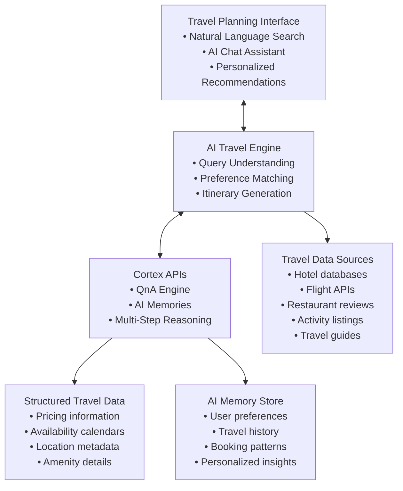

> **Status**: This guide is in progress.

This guide demonstrates how to build a revolutionary AI-powered travel planning platform that transforms how travelers discover, plan, and book their trips. Instead of traditional keyword searches and manual browsing, your platform will understand natural language queries and provide intelligent, personalized travel recommendations using Cortex's advanced AI capabilities.

> **Note**: All code examples in this guide are for demonstration purposes. They show the concepts and patterns you can use when building your own travel planning application with Cortex APIs. Follow the [actual API documentation](https://docs.usecortex.ai/api-reference/introduction) to adapt these examples to your specific use case, technology stack, and requirements.

## The Problem with Traditional Travel Planning

Traditional travel platforms force users to think like search engines:

- **Keyword matching**: "Hotels in Paris" or "Flights to Tokyo"
- **Filter-heavy interfaces**: Complex combinations of dates, prices, and amenities
- **Manual research**: Hours spent comparing options across multiple sites
- **Generic recommendations**: One-size-fits-all suggestions that ignore personal preferences
- **Fragmented experience**: Separate searches for flights, hotels, activities, and restaurants

## The AI-Powered Solution

With Cortex, travelers can plan naturally and get personalized recommendations:

- **"Plan a 5-day romantic trip to Italy for my anniversary in September with a budget of $3000"**
- **"Find me a family-friendly resort in Bali with a kids club and water sports activities"**
- **"I want to experience authentic local cuisine in Bangkok - suggest restaurants and food tours"**
- **"Plan a solo backpacking trip through Southeast Asia for 3 weeks, focusing on cultural experiences"**
- **"Find pet-friendly accommodations in San Francisco with easy access to dog parks"**

## Architecture Overview



## Step 1: Travel Data Ingestion Strategy

### 1.1 Hotel and Accommodation Data

Start by uploading comprehensive hotel and accommodation data using Cortex's batch upload capabilities:

```javascript
const uploadHotelData = async (hotels) => {
  const hotelSources = hotels.map(hotel => ({
    id: `hotel_${hotel.id}`,
    title: hotel.name,
    type: "accommodation",
    description: hotel.description,
    timestamp: new Date().toISOString(),
    content: {
      text: `${hotel.name} - ${hotel.description}. Located in ${hotel.city}, ${hotel.country}. 
             Amenities: ${hotel.amenities.join(', ')}. 
             Average rating: ${hotel.rating}/5 from ${hotel.reviewCount} reviews. 
             Price range: ${hotel.priceRange}. 
             Room types: ${hotel.roomTypes.join(', ')}.`,
      markdown: generateHotelMarkdown(hotel)
    },
    collections: ["accommodation", hotel.city.toLowerCase(), hotel.country.toLowerCase()],
    meta: {
      location: hotel.coordinates,
      priceRange: hotel.priceRange,
      rating: hotel.rating,
      amenities: hotel.amenities,
      propertyType: hotel.propertyType
    }
  }));

  await cortex.uploadBatch(hotelSources);
};
```

### 1.2 Flight and Transportation Data

Upload flight schedules, routes, and transportation options:

```javascript
const uploadFlightData = async (flights) => {
  const flightSources = flights.map(flight => ({
    id: `flight_${flight.id}`,
    title: `${flight.airline} ${flight.flightNumber}`,
    type: "transportation",
    description: `Flight from ${flight.origin} to ${flight.destination}`,
    timestamp: new Date().toISOString(),
    content: {
      text: `${flight.airline} flight ${flight.flightNumber} from ${flight.origin} to ${flight.destination}. 
             Duration: ${flight.duration}. 
             Aircraft: ${flight.aircraft}. 
             Departure: ${flight.departureTime}. 
             Arrival: ${flight.arrivalTime}.`,
    },
    collections: ["transportation", "flights", flight.origin, flight.destination],
    meta: {
      origin: flight.origin,
      destination: flight.destination,
      airline: flight.airline,
      duration: flight.duration,
      price: flight.price,
      class: flight.class
    }
  }));

  await cortex.uploadBatch(flightSources);
};
```

### 1.3 Restaurant and Dining Data

Upload restaurant information with cuisine types and reviews:

```javascript
const uploadRestaurantData = async (restaurants) => {
  const restaurantSources = restaurants.map(restaurant => ({
    id: `restaurant_${restaurant.id}`,
    title: restaurant.name,
    type: "dining",
    description: restaurant.description,
    timestamp: new Date().toISOString(),
    content: {
      text: `${restaurant.name} - ${restaurant.description}. 
             Cuisine: ${restaurant.cuisine}. 
             Location: ${restaurant.address}. 
             Price range: ${restaurant.priceRange}. 
             Rating: ${restaurant.rating}/5. 
             Specialties: ${restaurant.specialties.join(', ')}.`,
    },
    collections: ["dining", restaurant.cuisine.toLowerCase(), restaurant.city.toLowerCase()],
    meta: {
      cuisine: restaurant.cuisine,
      priceRange: restaurant.priceRange,
      rating: restaurant.rating,
      location: restaurant.coordinates,
      dietaryOptions: restaurant.dietaryOptions
    }
  }));

  await cortex.uploadBatch(restaurantSources);
};
```

### 1.4 Activity and Attraction Data

Upload tourist attractions, activities, and experiences:

```javascript
const uploadActivityData = async (activities) => {
  const activitySources = activities.map(activity => ({
    id: `activity_${activity.id}`,
    title: activity.name,
    type: "activity",
    description: activity.description,
    timestamp: new Date().toISOString(),
    content: {
      text: `${activity.name} - ${activity.description}. 
             Category: ${activity.category}. 
             Duration: ${activity.duration}. 
             Difficulty: ${activity.difficulty}. 
             Best time to visit: ${activity.bestSeason}. 
             Price: ${activity.price}.`,
    },
    collections: ["activities", activity.category.toLowerCase(), activity.city.toLowerCase()],
    meta: {
      category: activity.category,
      duration: activity.duration,
      difficulty: activity.difficulty,
      price: activity.price,
      ageGroup: activity.ageGroup
    }
  }));

  await cortex.uploadBatch(activitySources);
};
```

## Step 2: Building the AI Travel Assistant

### 2.1 Natural Language Query Processing

Create a travel query handler that understands complex travel requests:

```javascript
class TravelAssistant {
  constructor(cortex) {
    this.cortex = cortex;
  }

  async planTrip(query, userProfile) {
    // Use Cortex's multi-step reasoning for complex travel planning
    const response = await this.cortex.qna({
      question: query,
      session_id: userProfile.sessionId,
      tenant_id: userProfile.tenantId,
      user_name: userProfile.name,
      multi_step_reasoning: true,
      search_modes: ['semantic', 'hybrid'],
      metadata: {
        user_preferences: userProfile.preferences,
        travel_history: userProfile.travelHistory
      }
    });

    return this.processResponse(response);
  }

  async processResponse(response) {
    // Generate structured itinerary from AI response
    return {
      itinerary: this.extractItinerary(response.answer),
      recommendations: this.extractRecommendations(response.sources),
      reasoningSteps: response.reasoning_steps
    };
  }
}
```

### 2.2 Personalized Recommendation Engine

Implement AI memories to remember user preferences and past travel patterns:

```javascript
class PersonalizationEngine {
  constructor(cortex) {
    this.cortex = cortex;
  }

  async generateUserMemory(userInteraction) {
    // Generate memories based on user's travel preferences and booking patterns
    await this.cortex.generateUserMemory({
      tenant_id: userInteraction.tenantId,
      sub_tenant_id: userInteraction.userId,
      user_message: `User searched for: ${userInteraction.query}. 
                   They showed interest in: ${userInteraction.clickedItems.join(', ')}. 
                   They booked: ${userInteraction.bookedItems.join(', ')}.`,
      user_name: userInteraction.userName
    });
  }

  async getPersonalizedRecommendations(userId, destination, userName) {
    // Retrieve user memories to provide personalized recommendations
    const memories = await this.cortex.retrieveUserMemory({
      query: `travel preferences for ${destination}`,
      user_name: userName,
      max_count: 10
    });

    return this.generateRecommendations(memories, destination);
  }
}
```

## Step 3: Advanced Search Capabilities

### 3.1 Semantic Search for Travel Experiences

Implement semantic search to understand complex travel desires:

```javascript
const searchTravelExperiences = async (query, filters = {}) => {
  const searchQuery = `${query} ${filters.destination ? `in ${filters.destination}` : ''} 
                       ${filters.budget ? `budget ${filters.budget}` : ''}
                       ${filters.travelStyle ? `${filters.travelStyle} travel` : ''}`;

  const response = await cortex.qna({
    question: searchQuery,
    search_modes: ['semantic'],
    metadata: {
      travel_type: filters.travelType,
      destination: filters.destination,
      budget_range: filters.budget
    },
    top_n: 20
  });

  return response;
};
```

### 3.2 Multi-Modal Travel Search

Support different types of travel queries:

```javascript
const handleTravelQuery = async (query, context) => {
  // Determine query type and route appropriately
  const queryType = classifyQuery(query);
  
  switch (queryType) {
    case 'accommodation':
      return await searchAccommodation(query, context);
    case 'transportation':
      return await searchTransportation(query, context);
    case 'dining':
      return await searchDining(query, context);
    case 'activities':
      return await searchActivities(query, context);
    case 'full_itinerary':
      return await planFullItinerary(query, context);
    default:
      return await generalTravelSearch(query, context);
  }
};
```

## Step 4: Real-World Implementation Examples

### 4.1 Family Vacation Planning

**User Query**: *"Plan a 7-day family vacation to Orlando with kids aged 8 and 12, budget $4000, we love theme parks and want kid-friendly restaurants"*

```javascript
const planFamilyVacation = async (query, userProfile) => {
  const response = await cortex.qna({
    question: query,
    session_id: userProfile.sessionId,
    tenant_id: userProfile.tenantId,
    user_name: userProfile.name,
    multi_step_reasoning: true,
    metadata: {
      travel_type: "family",
      destination: "Orlando",
      budget: "$4000",
      duration: "7 days",
      kids_ages: [8, 12]
    }
  });

  // Process response to generate structured itinerary
  const itinerary = {
    accommodation: extractHotelRecommendations(response.sources),
    activities: extractFamilyActivities(response.sources),
    dining: extractKidFriendlyRestaurants(response.sources),
    transportation: extractTransportationOptions(response.sources)
  };

  return itinerary;
};
```

### 4.2 Business Travel Optimization

**User Query**: *"I need to travel to London for business next week, find hotels near financial district with good WiFi and meeting rooms"*

```javascript
const planBusinessTravel = async (query, userProfile) => {
  const response = await cortex.qna({
    question: query,
    session_id: userProfile.sessionId,
    tenant_id: userProfile.tenantId,
    user_name: userProfile.name,
    metadata: {
      travel_type: "business",
      destination: "London",
      amenities_required: ["wifi", "meeting_rooms"],
      location_preference: "financial_district"
    }
  });

  return procesBusinessTravelResponse(response);
};
```

### 4.3 Adventure Travel Planning

**User Query**: *"I want to go trekking in Nepal for 2 weeks, suggest routes for intermediate hikers with cultural experiences"*

```javascript
const planAdventureTravel = async (query, userProfile) => {
  const response = await cortex.qna({
    question: query,
    session_id: userProfile.sessionId,
    tenant_id: userProfile.tenantId,
    user_name: userProfile.name,
    multi_step_reasoning: true,
    metadata: {
      travel_type: "adventure",
      destination: "Nepal",
      activity_type: "trekking",
      skill_level: "intermediate",
      interests: ["cultural_experiences"]
    }
  });

  return processAdventureResponse(response);
};
```

## Step 5: Contextual Recommendations

### 5.1 Weather-Based Suggestions

```javascript
const getWeatherBasedRecommendations = async (destination, travelDate) => {
  const weatherQuery = `What activities and attractions are best in ${destination} during ${travelDate} considering weather conditions?`;
  
  const response = await cortex.qna({
    question: weatherQuery,
    metadata: {
      destination: destination,
      travel_date: travelDate,
      context_type: "weather"
    }
  });

  return response;
};
```

### 5.2 Cultural Event Integration

```javascript
const getCulturalEventRecommendations = async (destination, travelDate) => {
  const eventQuery = `What cultural events, festivals, or seasonal experiences are happening in ${destination} during ${travelDate}?`;
  
  const response = await cortex.qna({
    question: eventQuery,
    metadata: {
      destination: destination,
      travel_date: travelDate,
      context_type: "cultural_events"
    }
  });

  return response;
};
```

## Step 6: Learning from User Behavior

### 6.1 Booking Pattern Analysis

```javascript
const analyzeBookingPatterns = async (userId, bookingData) => {
  const analysisQuery = `User ${userId} has booked: ${bookingData.map(b => b.description).join(', ')}. What patterns can we identify about their travel preferences?`;
  
  // Generate memory for future personalization
  await cortex.generateUserMemory({
    tenant_id: userId,
    sub_tenant_id: userId,
    user_message: analysisQuery,
    user_name: bookingData[0].userName
  });
};
```

### 6.2 Search Refinement

```javascript
const refineSearch = async (originalQuery, userFeedback, sessionId) => {
  const refinedQuery = `${originalQuery}. User feedback: ${userFeedback}. Please adjust recommendations accordingly.`;
  
  const response = await cortex.qna({
    question: refinedQuery,
    session_id: sessionId,
    multi_step_reasoning: true
  });

  return response;
};
```

## Advanced Features

### Multi-Language Support

```javascript
const handleMultiLanguageQuery = async (query, language, destination) => {
  const localizedQuery = `${query} (query in ${language} for ${destination})`;
  
  const response = await cortex.qna({
    question: localizedQuery,
    metadata: {
      language: language,
      destination: destination
    }
  });

  return response;
};
```

### Real-Time Price Monitoring

```javascript
const monitorPriceChanges = async (travelPlan) => {
  const priceQuery = `Monitor price changes for: ${travelPlan.description}. Alert if prices drop by 10% or more.`;
  
  // Set up monitoring using Cortex memories
  await cortex.addUserMemory({
    tenant_id: travelPlan.userId,
    sub_tenant_id: travelPlan.userId,
    user_memory: priceQuery
  });
};
```

## Example User Interactions

### Scenario 1: Spontaneous Weekend Trip

**User**: *"I want to go somewhere warm this weekend, budget $800, flying from New York"*

**AI Response**: Based on your budget and preference for warm weather, I recommend:
- **Miami, Florida**: 3-day weekend package with beachfront hotel and flights for $750
- **Austin, Texas**: Music and food scene with boutique hotel for $680
- **Savannah, Georgia**: Historic charm with B&B accommodation for $620

### Scenario 2: Anniversary Celebration

**User**: *"Plan a romantic anniversary trip to Paris for 5 days in May, we love art museums and fine dining"*

**AI Response**: For your romantic Paris anniversary:
- **Accommodation**: Hotel des Grands Boulevards in the 2nd arrondissement
- **Day 1**: Louvre Museum morning, Seine river cruise evening
- **Day 2**: Musée d'Orsay, dinner at L'Ambroisie (Michelin 3-star)
- **Day 3**: Montmartre walking tour, Picasso Museum
- **Day 4**: Versailles day trip, romantic dinner at Le Meurice
- **Day 5**: Rodin Museum, farewell lunch at L'Atelier de Joël Robuchon

### Scenario 3: Solo Adventure Planning

**User**: *"I'm planning a solo backpacking trip through Southeast Asia for a month, focusing on cultural immersion and budget-friendly options"*

**AI Response**: Your month-long Southeast Asia adventure:
- **Route**: Thailand → Vietnam → Cambodia → Laos
- **Budget**: $2,000-2,500 total
- **Accommodation**: Mix of hostels and homestays
- **Cultural experiences**: Cooking classes, temple visits, local festivals
- **Transportation**: Buses and trains for authentic experience

## Integration with Booking Systems

### Real-Time Availability Checking

```javascript
const checkAvailability = async (hotelId, checkIn, checkOut) => {
  const availabilityQuery = `Check availability for ${hotelId} from ${checkIn} to ${checkOut}`;
  
  const response = await cortex.qna({
    question: availabilityQuery,
    metadata: {
      hotel_id: hotelId,
      check_in: checkIn,
      check_out: checkOut,
      query_type: "availability"
    }
  });

  return response;
};
```

### Dynamic Pricing Integration

```javascript
const getDynamicPricing = async (searchResults, userProfile) => {
  const pricingQuery = `Get current pricing for these travel options considering user's booking history and preferences`;
  
  const response = await cortex.qna({
    question: pricingQuery,
    metadata: {
      user_tier: userProfile.loyaltyTier,
      booking_history: userProfile.bookingHistory,
      search_results: searchResults
    }
  });

  return response;
};
```

## Conclusion

Building an AI travel planner with Cortex transforms the travel planning experience from a tedious research process into an intelligent, conversational journey. By leveraging Cortex's AI memories, multi-step reasoning, and semantic search capabilities, you can create a platform that truly understands traveler intent and provides personalized recommendations.

Key benefits of this approach:

- **Natural Language Understanding**: Users can express complex travel desires in natural language
- **Personalized Recommendations**: AI memories ensure recommendations improve over time
- **Contextual Awareness**: Multi-step reasoning considers all aspects of travel planning
- **Seamless Integration**: Easy integration with existing booking systems and travel APIs

The result is a travel planning platform that feels more like having a knowledgeable travel advisor than using a search engine, creating higher user satisfaction and better conversion rates for travel businesses. 