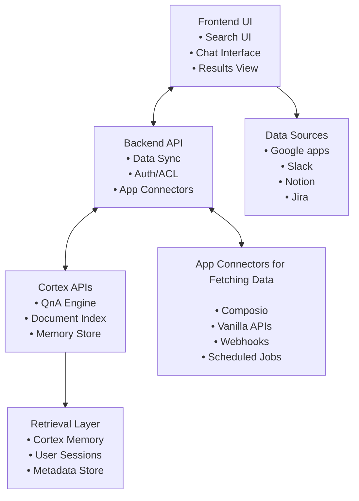

> **Status**: This guide is in progress.

This guide will walk you through building an extremely powerful workplace search and AI assistant platform that rivals Glean using Cortex APIs. You'll learn how to create a unified search experience across multiple data sources with AI-powered Q&A capabilities.

> **Note**: All code examples in this guide are for demonstration purposes. They show the concepts and patterns you can use when building your own Glean-like application with Cortex APIs. You'll need to adapt these examples to your specific use case, technology stack, and requirements.

## Overview

A Glean-like application typically includes these core features:

- **Universal Search**: Search across multiple data sources (documents, emails, chats, etc.)
- **AI-Powered Q&A**: Get intelligent answers based on company knowledge
- **AI Memories for User Preferences**: Remember and adapt to individual user preferences, search patterns, and behavioral patterns
- **Data Ingestion**: Connect to various apps and services
- **Knowledge Graph**: Build connections between information
- **Security & Access Control**: Role-based permissions and data isolation

## Architecture Overview



## Step 1: Data Ingestion Strategy

### 1.1 App Connectors Setup

You'll need to connect to various data sources. Here are recommended approaches:

#### Option A: Using Composio

[Composio](https://composio.dev/) provides pre-built connectors for popular apps:

```javascript
// Example: Setting up Composio connector
const composioConfig = {
  connectors: [
    {
      name: 'slack',
      config: {
        token: process.env.SLACK_BOT_TOKEN,
        channels: ['general', 'random', 'project-*']
      }
    },
    {
      name: 'gmail',
      config: {
        credentials: process.env.GMAIL_CREDENTIALS,
        labels: ['INBOX', 'SENT', 'IMPORTANT']
      }
    },
    {
      name: 'notion',
      config: {
        token: process.env.NOTION_TOKEN,
        databases: ['projects', 'docs', 'meetings']
      }
    }
  ]
};
```

#### Option B: Vanilla API Integration

For custom integrations, use the native APIs:

```javascript
// Example: Slack API integration
class SlackConnector {
  constructor(token) {
    this.token = token;
    this.client = new WebClient(token);
  }

  async fetchMessages(channelId, limit = 100) {
    const result = await this.client.conversations.history({
      channel: channelId,
      limit: limit
    });
    
    return result.messages.map(msg => ({
      id: msg.ts,
      text: msg.text,
      user: msg.user,
      timestamp: msg.ts,
      channel: channelId,
      type: 'slack_message'
    }));
  }

  async fetchChannels() {
    const result = await this.client.conversations.list();
    return result.channels;
  }
}

// Example: Gmail API integration
class GmailConnector {
  constructor(credentials) {
    this.gmail = google.gmail({ version: 'v1', auth: credentials });
  }

  async fetchEmails(query = 'in:inbox', maxResults = 100) {
    const response = await this.gmail.users.messages.list({
      userId: 'me',
      q: query,
      maxResults: maxResults
    });

    const emails = [];
    for (const message of response.data.messages) {
      const email = await this.gmail.users.messages.get({
        userId: 'me',
        id: message.id
      });
      
      emails.push({
        id: email.data.id,
        subject: this.getHeader(email.data.payload.headers, 'Subject'),
        from: this.getHeader(email.data.payload.headers, 'From'),
        body: this.getBody(email.data.payload),
        timestamp: email.data.internalDate,
        type: 'gmail'
      });
    }
    
    return emails;
  }
}
```

### 1.2 Data Normalization

Create a unified data format for all sources:

> **Important**: For optimal performance, limit each batch to a maximum of **20 app sources** per request. Send multiple batch requests with an interval of **1 second** between each request.

```javascript
// Unified data structure for Cortex app upload
const normalizedData = {
  id: 'unique_source_id',
  title: 'Document/Message Title',
  type: 'slack_message', // Required: gmail, slack_message, notion_page, document, etc.
  timestamp: '2024-01-01T00:00:00Z', // Required: ISO timestamp
  content: {
    text: 'Main content text',
    html_base64: 'base64_encoded_html',
    markdown: 'markdown_content'
  },
  collections: ['engineering', 'product', 'sales'], // Optional: for organization
  url: 'https://app.com/item/123', // Optional: source URL
  description: 'Optional description of the source', // Optional
  cortex_metadata: {}, // Optional: custom metadata for Cortex processing
  meta: {
    author: 'user@company.com',
    source_id: 'original_source_id',
    tags: ['project-a', 'urgent', 'meeting-notes'],
    permissions: ['user1@company.com', 'user2@company.com']
  }
};
```

### 1.3 Batch Upload to Cortex

Use Cortex's batch upload capabilities for efficient data ingestion:

> **Best Practice**: Always verify processing after upload using the `/upload/verify_processing` endpoint to ensure your data is properly indexed.

```javascript
class CortexDataIngestion {
  constructor(apiKey, tenantId) {
    this.apiKey = apiKey;
    this.tenantId = tenantId;
    this.baseUrl = 'https://api.usecortex.ai'; // Cortex API base URL
  }

  async uploadBatch(sources, subTenantId = null) {
    const url = `${this.baseUrl}/upload/upload_app_sources?tenant_id=${this.tenantId}`;
    if (subTenantId) {
      url += `&sub_tenant_id=${subTenantId}`;
    }

    const response = await fetch(url, {
      method: 'POST',
      headers: {
        'Authorization': `Bearer ${this.apiKey}`,
        'Content-Type': 'application/json',
        'accept': 'application/json'
      },
      body: JSON.stringify(sources)
    });

    return response.json();
  }

  async uploadWithVerification(sources, subTenantId = null) {
    const uploadResult = await this.uploadBatch(sources, subTenantId);
    
    // Verify processing for each source
    if (uploadResult.source_ids) {
      for (const sourceId of uploadResult.source_ids) {
        const status = await this.verifyProcessing(sourceId);
        if (status.indexing_status === 'errored') {
          throw new Error(`Processing failed for source ${sourceId}`);
        }
      }
    }
    
    return uploadResult;
  }

  async verifyProcessing(fileId) {
    const url = `${this.baseUrl}/upload/verify_processing?file_id=${fileId}`;
    
    const response = await fetch(url, {
      method: 'POST',
      headers: {
        'Authorization': `Bearer ${this.apiKey}`,
        'accept': 'application/json'
      }
    });

    return response.json();
  }

  async uploadDocuments(files, metadata = {}) {
    const formData = new FormData();
    
    files.forEach(file => {
      formData.append('files', file);
    });
    
    if (Object.keys(metadata).length > 0) {
      formData.append('tenant_metadata', JSON.stringify(metadata.tenant_metadata));
      formData.append('document_metadata', JSON.stringify(metadata.document_metadata));
    }

    const url = `${this.baseUrl}/upload/batch_upload?tenant_id=${this.tenantId}`;
    
    const response = await fetch(url, {
      method: 'POST',
      headers: {
        'Authorization': `Bearer ${this.apiKey}`,
        'accept': 'application/json'
      },
      body: formData
    });

    return response.json();
  }
}
```

## Step 2: Search and Q&A Implementation

### 2.1 Universal Search Interface

Create a search interface that queries across all data sources:

> **Note**: Cortex supports filtering by `source_title` and `source_type` using the `metadata` parameter. Use these for targeted searches across specific data sources.

```javascript
class GleanSearch {
  constructor(apiKey, tenantId) {
    this.apiKey = apiKey;
    this.tenantId = tenantId;
    this.baseUrl = 'https://api.usecortex.ai'; // Cortex API base URL
  }

  async search(query, options = {}) {
    const {
      sessionId = this.generateSessionId(),
      subTenantId = null,
      stream = false,
      topN = 10,
      searchModes = ['creative'],
      metadata = null,
      userName = null,
      userInstructions = null
    } = options;

    const payload = {
      question: query,
      session_id: sessionId,
      tenant_id: this.tenantId,
      stream: stream,
      top_n: topN,
      search_modes: searchModes,
      ai_generation: true,
      highlight_chunks: true,
      multi_step_reasoning: true,
      auto_agent_routing: true,
      search_alpha: 0.5, // Weight for semantic match (0.0 to 1.0)
      recency_bias: 0.3  // Recency preference (0.0 to 1.0)
    };

    if (subTenantId) payload.sub_tenant_id = subTenantId;
    if (metadata) payload.metadata = metadata;
    if (userName) payload.user_name = userName;
    if (userInstructions) payload.user_instructions = userInstructions;

    const response = await fetch(`${this.baseUrl}/search/qna`, {
      method: 'POST',
      headers: {
        'Authorization': `Bearer ${this.apiKey}`,
        'Content-Type': 'application/json',
        'accept': 'application/json'
      },
      body: JSON.stringify(payload)
    });

    return response.json();
  }

  async searchBySourceType(query, sourceType) {
    return this.search(query, {
      metadata: { source_type: sourceType }
    });
  }

  async searchBySourceTitle(query, sourceTitle) {
    return this.search(query, {
      metadata: { source_title: sourceTitle }
    });
  }

  async searchByCollection(query, collection) {
    // This would require custom implementation based on your data structure
    // You might need to maintain a separate mapping of collections to source IDs
  }

  generateSessionId() {
    return `session_${Date.now()}_${Math.random().toString(36).substr(2, 9)}`;
  }
}
```

### 2.2 Advanced Search Features

Implement advanced search capabilities:

> **Advanced Features**:
>
> - `multi_step_reasoning`: Automatically decomposes complex queries into steps
> - `auto_agent_routing`: Routes queries to the best suitable AI agent
> - `search_alpha`: Controls semantic vs keyword matching (0.0-1.0)
> - `recency_bias`: Prioritizes recent content (0.0-1.0)

```javascript
class AdvancedSearch extends GleanSearch {
  async searchWithFilters(query, filters = {}) {
    const { sourceTypes, sourceTitles, dateRange, authors, tags } = filters;
    
    // Build metadata filter (Cortex only supports source_title and source_type)
    const metadata = {};
    if (sourceTypes) metadata.source_type = sourceTypes;
    if (sourceTitles) metadata.source_title = sourceTitles;

    return this.search(query, { metadata });
  }

  async searchWithContext(query, contextSources = []) {
    // Use context_list parameter to focus search on specific sources
    return this.search(query, {
      context_list: contextSources
    });
  }

  async conversationalSearch(query, conversationHistory = []) {
    // Implement conversation memory using session_id
    const sessionId = this.getOrCreateSessionId();
    
    // Store conversation history in your backend
    await this.storeConversationHistory(sessionId, conversationHistory);
    
    return this.search(query, {
      sessionId,
      userInstructions: `Previous conversation context: ${JSON.stringify(conversationHistory)}`
    });
  }
}
```

### 2.3 AI Memories and User Preferences

One of the most powerful features of building a Glean-like application with Cortex is leveraging **AI Memories** to create truly personalized experiences. Cortex automatically manages AI memories when you provide a `user_name` and maintain consistent `session_id` values. This allows your application to remember user preferences, past interactions, and behavioral patterns, making every search and interaction more relevant and efficient.

#### Understanding AI Memories

Cortex's AI memories are dynamic, user-specific profiles that evolve over time. They capture not just what users say, but their intentions, preferences, and unique behaviors. Cortex automatically manages these memories when you provide a `user_name` and maintain consistent `session_id` values. This enables your Glean clone to:

- **Remember User Preferences**: Format preferences, source preferences, search patterns
- **Understand Intent**: Learn what types of information users typically seek
- **Adapt Responses**: Tailor answers based on past interactions
- **Anticipate Needs**: Suggest relevant information before users ask

#### Implementing AI Memories in Your Search

```javascript
class PersonalizedSearch extends AdvancedSearch {
  constructor(apiKey, tenantId) {
    super(apiKey, tenantId);
    this.userProfiles = new Map();
  }

  async searchWithMemory(query, userId, options = {}) {
    // Get user's AI memory profile (optional - for additional customization)
    const userProfile = await this.getUserProfile(userId);
    
    // Build personalized search options
    const personalizedOptions = {
      ...options,
      userName: userId, // Cortex can automatically manage user memories
      userInstructions: this.buildPersonalizedInstructions(userProfile, query)
    };

    // Add user's preferred search modes and parameters
    if (userProfile.preferredSearchModes) {
      personalizedOptions.searchModes = userProfile.preferredSearchModes;
    }

    if (userProfile.preferredSourceTypes) {
      personalizedOptions.metadata = {
        ...personalizedOptions.metadata,
        source_type: userProfile.preferredSourceTypes
      };
    }

    // Use session_id to maintain conversation context
    const sessionId = await this.getUserSessionId(userId);
    
    const searchResults = await this.search(query, {
      ...personalizedOptions,
      sessionId
    });

    // Update user profile based on this interaction (optional)
    await this.updateUserProfile(userId, query, searchResults);

    return searchResults;
  }

  async getUserProfile(userId) {
    // Retrieve user's AI memory profile from your backend
    // Note: Cortex automatically manages user memories via userName and sessionId
    // This is for additional customization beyond what Cortex provides
    let profile = this.userProfiles.get(userId);
    
    if (!profile) {
      profile = {
        userId,
        preferredSearchModes: ['creative'],
        preferredSourceTypes: [],
        frequentQueries: [],
        preferredFormats: ['bullet_points'],
        responseStyle: 'concise',
        favoriteSources: [],
        searchHistory: [],
        lastInteraction: null
      };
      this.userProfiles.set(userId, profile);
    }
    
    return profile;
  }

  buildPersonalizedInstructions(userProfile, query) {
    let instructions = `User preferences: `;
    
    if (userProfile.preferredFormats.includes('bullet_points')) {
      instructions += `Prefer bullet point responses. `;
    }
    
    if (userProfile.responseStyle === 'concise') {
      instructions += `Keep responses concise and to the point. `;
    }
    
    if (userProfile.favoriteSources.length > 0) {
      instructions += `User frequently uses sources: ${userProfile.favoriteSources.join(', ')}. `;
    }
    
    if (userProfile.frequentQueries.length > 0) {
      instructions += `User often searches for: ${userProfile.frequentQueries.slice(0, 3).join(', ')}. `;
    }
    
    instructions += `Current query: ${query}`;
    
    return instructions;
  }

  async updateUserProfile(userId, query, searchResults) {
    const profile = await this.getUserProfile(userId);
    
    // Update search history
    profile.searchHistory.push({
      query,
      timestamp: new Date().toISOString(),
      resultCount: searchResults.sources?.length || 0
    });
    
    // Keep only last 50 searches
    if (profile.searchHistory.length > 50) {
      profile.searchHistory = profile.searchHistory.slice(-50);
    }
    
    // Update frequent queries
    const queryLower = query.toLowerCase();
    const existingIndex = profile.frequentQueries.findIndex(q => 
      q.toLowerCase().includes(queryLower) || queryLower.includes(q.toLowerCase())
    );
    
    if (existingIndex === -1) {
      profile.frequentQueries.unshift(query);
      profile.frequentQueries = profile.frequentQueries.slice(0, 10);
    }
    
    // Update favorite sources based on what user clicks/uses
    if (searchResults.sources) {
      searchResults.sources.forEach(source => {
        if (!profile.favoriteSources.includes(source.type)) {
          profile.favoriteSources.push(source.type);
        }
      });
      profile.favoriteSources = profile.favoriteSources.slice(0, 5);
    }
    
    // Update last interaction
    profile.lastInteraction = new Date().toISOString();
    
    // Save updated profile
    this.userProfiles.set(userId, profile);
    await this.saveUserProfile(userId, profile);
  }

  async saveUserProfile(userId, profile) {
    // Save to your backend database
    // This could be a simple database call or API call to your backend
    console.log(`Saving profile for user ${userId}:`, profile);
  }

  async getUserSessionId(userId) {
    // Maintain persistent session IDs for users to enable conversation memory
    const sessionKey = `session_${userId}`;
    let sessionId = localStorage.getItem(sessionKey);
    
    if (!sessionId) {
      sessionId = this.generateSessionId();
      localStorage.setItem(sessionKey, sessionId);
    }
    
    return sessionId;
  }
}
```

#### User Preference Learning

```javascript
class PreferenceLearner {
  constructor() {
    this.preferencePatterns = new Map();
  }

  async learnFromInteraction(userId, interaction) {
    const {
      query,
      selectedResults,
      responseFormat,
      searchFilters,
      timeSpent,
      followUpQueries
    } = interaction;

    const patterns = this.preferencePatterns.get(userId) || {
      queryPatterns: [],
      formatPreferences: {},
      sourcePreferences: {},
      timePatterns: [],
      filterPreferences: {}
    };

    // Learn query patterns
    this.learnQueryPatterns(patterns, query, followUpQueries);
    
    // Learn format preferences
    this.learnFormatPreferences(patterns, responseFormat, selectedResults);
    
    // Learn source preferences
    this.learnSourcePreferences(patterns, selectedResults);
    
    // Learn time patterns
    this.learnTimePatterns(patterns, timeSpent);
    
    // Learn filter preferences
    this.learnFilterPreferences(patterns, searchFilters);

    this.preferencePatterns.set(userId, patterns);
  }

  learnQueryPatterns(patterns, query, followUpQueries) {
    // Analyze query complexity, length, and type
    const queryAnalysis = {
      length: query.length,
      complexity: this.analyzeComplexity(query),
      type: this.classifyQueryType(query),
      hasFilters: query.includes('in:') || query.includes('from:'),
      timestamp: new Date().toISOString()
    };

    patterns.queryPatterns.push(queryAnalysis);
    
    // Keep only recent patterns
    if (patterns.queryPatterns.length > 100) {
      patterns.queryPatterns = patterns.queryPatterns.slice(-100);
    }
  }

  learnFormatPreferences(patterns, format, selectedResults) {
    if (!patterns.formatPreferences[format]) {
      patterns.formatPreferences[format] = 0;
    }
    patterns.formatPreferences[format]++;
  }

  learnSourcePreferences(patterns, selectedResults) {
    selectedResults.forEach(result => {
      const sourceType = result.type;
      if (!patterns.sourcePreferences[sourceType]) {
        patterns.sourcePreferences[sourceType] = 0;
      }
      patterns.sourcePreferences[sourceType]++;
    });
  }

  analyzeComplexity(query) {
    const words = query.split(' ').length;
    const hasQuotes = query.includes('"');
    const hasOperators = /AND|OR|NOT|in:|from:|to:/.test(query);
    
    let complexity = 'simple';
    if (words > 5 || hasQuotes || hasOperators) complexity = 'complex';
    if (words > 10 || (hasQuotes && hasOperators)) complexity = 'advanced';
    
    return complexity;
  }

  classifyQueryType(query) {
    if (query.includes('how to') || query.includes('steps')) return 'how-to';
    if (query.includes('what is') || query.includes('define')) return 'definition';
    if (query.includes('when') || query.includes('schedule')) return 'temporal';
    if (query.includes('who') || query.includes('contact')) return 'person';
    if (query.includes('where') || query.includes('location')) return 'location';
    return 'general';
  }
}
```

#### Memory-Enhanced Search Interface

```javascript
const MemoryEnhancedSearch = ({ userId }) => {
  const [query, setQuery] = useState('');
  const [results, setResults] = useState(null);
  const [userPreferences, setUserPreferences] = useState(null);
  const [suggestions, setSuggestions] = useState([]);

  const searchClient = new PersonalizedSearch(API_KEY, TENANT_ID);
  const preferenceLearner = new PreferenceLearner();

  useEffect(() => {
    // Load user preferences on component mount
    loadUserPreferences();
  }, [userId]);

  const loadUserPreferences = async () => {
    const profile = await searchClient.getUserProfile(userId);
    setUserPreferences(profile);
    
    // Generate search suggestions based on user's history
    const suggestions = generateSuggestions(profile);
    setSuggestions(suggestions);
  };

  const generateSuggestions = (profile) => {
    const suggestions = [];
    
    // Suggest based on frequent queries
    if (profile.frequentQueries.length > 0) {
      suggestions.push({
        type: 'frequent',
        text: profile.frequentQueries[0],
        label: 'Frequently searched'
      });
    }
    
    // Suggest based on recent searches
    if (profile.searchHistory.length > 0) {
      const recentSearches = profile.searchHistory
        .slice(-3)
        .map(h => h.query);
      
      recentSearches.forEach(query => {
        suggestions.push({
          type: 'recent',
          text: query,
          label: 'Recent search'
        });
      });
    }
    
    return suggestions;
  };

  const handleSearch = async () => {
    const startTime = Date.now();
    
    try {
      const searchResults = await searchClient.searchWithMemory(query, userId);
      setResults(searchResults);
      
      // Learn from this interaction
      const interaction = {
        query,
        selectedResults: [], // Will be populated when user clicks results
        responseFormat: searchResults.format || 'default',
        searchFilters: {},
        timeSpent: Date.now() - startTime,
        followUpQueries: []
      };
      
      await preferenceLearner.learnFromInteraction(userId, interaction);
      
    } catch (error) {
      console.error('Search failed:', error);
    }
  };

  const handleResultClick = async (result) => {
    // Update user preferences when they click on results
    const profile = await searchClient.getUserProfile(userId);
    
    // Mark this source type as preferred
    if (!profile.preferredSourceTypes.includes(result.type)) {
      profile.preferredSourceTypes.push(result.type);
      await searchClient.saveUserProfile(userId, profile);
    }
  };

  return (
    <div className="memory-enhanced-search">
      <div className="search-header">
        <input
          type="text"
          value={query}
          onChange={(e) => setQuery(e.target.value)}
          placeholder="Search with your preferences in mind..."
          className="search-input"
        />
        <button onClick={handleSearch}>Search</button>
      </div>

      {/* Show personalized suggestions */}
      {suggestions.length > 0 && (
        <div className="search-suggestions">
          <h4>Based on your preferences:</h4>
          {suggestions.map((suggestion, index) => (
            <button
              key={index}
              className="suggestion-chip"
              onClick={() => setQuery(suggestion.text)}
            >
              {suggestion.text}
              <span className="suggestion-label">{suggestion.label}</span>
            </button>
          ))}
        </div>
      )}

      {/* Show user preferences summary */}
      {userPreferences && (
        <div className="user-preferences">
          <details>
            <summary>Your Search Preferences</summary>
            <div className="preferences-content">
              <p><strong>Preferred sources:</strong> {userPreferences.preferredSourceTypes.join(', ') || 'None set'}</p>
              <p><strong>Response style:</strong> {userPreferences.responseStyle}</p>
              <p><strong>Frequent searches:</strong> {userPreferences.frequentQueries.slice(0, 3).join(', ')}</p>
            </div>
          </details>
        </div>
      )}

      {results && (
        <SearchResults 
          results={results} 
          onResultClick={handleResultClick}
          userPreferences={userPreferences}
        />
      )}
    </div>
  );
};
```

#### Benefits of AI Memories in Your Glean Clone

1. **Personalized Search Results**: Users get results tailored to their preferences and past behavior
2. **Faster Information Discovery**: The system learns what sources and formats users prefer
3. **Improved User Experience**: Every interaction feels more personal and relevant
4. **Reduced Cognitive Load**: Users don't need to repeat their preferences or search patterns
5. **Adaptive Learning**: The system continuously improves based on user interactions
6. **Automatic Management**: Cortex handles memory updates automatically - no manual implementation required

#### Best Practices for AI Memories

- **Respect Privacy**: Always give users control over their data and preferences
- **Transparency**: Show users what preferences are being used and allow them to modify them
- **Graceful Degradation**: Ensure the system works well even without user history
- **Consistent Session IDs**: Use persistent session IDs for users to maintain conversation context
- **User Names**: Provide consistent user names to enable Cortex's automatic memory management
- **Performance**: Cache user profiles to avoid repeated API calls


## Step 3: Frontend Implementation

### 3.1 Search Interface

```javascript
// React component example
import React, { useState, useEffect } from 'react';

const GleanSearchInterface = () => {
  const [query, setQuery] = useState('');
  const [results, setResults] = useState(null);
  const [loading, setLoading] = useState(false);
  const [filters, setFilters] = useState({
    sourceTypes: [],
    dateRange: null,
    authors: []
  });

  const searchClient = new AdvancedSearch(API_KEY, TENANT_ID);

  const handleSearch = async () => {
    setLoading(true);
    try {
      const searchResults = await searchClient.searchWithFilters(query, filters);
      setResults(searchResults);
    } catch (error) {
      console.error('Search failed:', error);
    } finally {
      setLoading(false);
    }
  };

  return (
    <div className="glean-search">
      <div className="search-header">
        <input
          type="text"
          value={query}
          onChange={(e) => setQuery(e.target.value)}
          placeholder="Search across all your work..."
          className="search-input"
        />
        <button onClick={handleSearch} disabled={loading}>
          {loading ? 'Searching...' : 'Search'}
        </button>
      </div>

      <div className="search-filters">
        <SourceTypeFilter
          value={filters.sourceTypes}
          onChange={(types) => setFilters({...filters, sourceTypes: types})}
        />
        <DateRangeFilter
          value={filters.dateRange}
          onChange={(range) => setFilters({...filters, dateRange: range})}
        />
      </div>

      {results && (
        <SearchResults results={results} />
      )}
    </div>
  );
};
```

### 3.2 Results Display

```javascript
const SearchResults = ({ results }) => {
  const { answer, sources, chunks } = results;

  return (
    <div className="search-results">
      {answer && (
        <div className="ai-answer">
          <h3>AI Answer</h3>
          <div className="answer-content" dangerouslySetInnerHTML={{ __html: answer }} />
        </div>
      )}

      {sources && sources.length > 0 && (
        <div className="source-results">
          <h3>Sources ({sources.length})</h3>
          {sources.map((source, index) => (
            <SourceCard key={index} source={source} chunks={chunks} />
          ))}
        </div>
      )}
    </div>
  );
};

const SourceCard = ({ source, chunks }) => {
  const sourceChunks = chunks?.filter(chunk => chunk.source_id === source.source_id) || [];

  return (
    <div className="source-card">
      <div className="source-header">
        <span className="source-type">{source.type}</span>
        <span className="source-title">{source.title}</span>
        <span className="source-date">{formatDate(source.timestamp)}</span>
      </div>
      
      {sourceChunks.map((chunk, index) => (
        <div key={index} className="source-chunk">
          <p>{chunk.text}</p>
          {chunk.bounding_box && (
            <div className="chunk-highlight">
              Page {source.page}, Position: {chunk.bounding_box.x}, {chunk.bounding_box.y}
            </div>
          )}
        </div>
      ))}
    </div>
  );
};
```

## Step 4: Data Synchronization

### 4.1 Scheduled Sync Jobs

```javascript
class DataSyncManager {
  constructor(connectors, cortexIngestion) {
    this.connectors = connectors;
    this.cortexIngestion = cortexIngestion;
    this.syncIntervals = {
      slack: 5 * 60 * 1000, // 5 minutes
      gmail: 10 * 60 * 1000, // 10 minutes
      notion: 30 * 60 * 1000, // 30 minutes
      documents: 60 * 60 * 1000 // 1 hour
    };
  }

  async startSync() {
    // Start sync jobs for each connector
    Object.entries(this.syncIntervals).forEach(([connector, interval]) => {
      setInterval(() => {
        this.syncConnector(connector);
      }, interval);
    });
  }

  async syncConnector(connectorName) {
    try {
      const connector = this.connectors[connectorName];
      const newData = await connector.fetchNewData();
      
      if (newData.length > 0) {
        const normalizedData = newData.map(item => 
          this.normalizeData(item, connectorName)
        );
        
        // Use batch upload with verification
        await this.cortexIngestion.uploadWithVerification(normalizedData);
        console.log(`Synced ${newData.length} items from ${connectorName}`);
      }
    } catch (error) {
      console.error(`Sync failed for ${connectorName}:`, error);
      // Implement retry logic with exponential backoff
      await this.retrySync(connectorName, error);
    }
  }

  async retrySync(connectorName, error, attempt = 1) {
    const maxAttempts = 3;
    const delay = Math.pow(2, attempt) * 1000; // Exponential backoff
    
    if (attempt < maxAttempts) {
      console.log(`Retrying sync for ${connectorName} in ${delay}ms (attempt ${attempt + 1})`);
      setTimeout(() => {
        this.syncConnector(connectorName);
      }, delay);
    } else {
      console.error(`Max retry attempts reached for ${connectorName}:`, error);
    }
  }

  normalizeData(item, sourceType) {
    return {
      id: `${sourceType}_${item.id}`,
      title: item.title || item.subject || item.text?.substring(0, 100),
      type: sourceType, // Required field
      timestamp: item.timestamp || item.created_at || new Date().toISOString(), // Required field
      content: {
        text: item.text || item.body || item.content,
        html_base64: item.html ? btoa(item.html) : '',
        markdown: item.markdown || ''
      },
      collections: item.collections || [], // Move from cortex_metadata
      url: item.url,
      description: item.description,
      cortex_metadata: {}, // Keep empty or for custom data
      meta: {
        source_id: item.id,
        author: item.author || item.user,
        tags: item.tags || [],
        created_at: item.created_at,
        updated_at: item.updated_at
      }
    };
  }
}
```

### 4.2 Webhook Integration

```javascript
// Express.js webhook handler
app.post('/webhooks/slack', async (req, res) => {
  const { event } = req.body;
  
  if (event.type === 'message') {
    const normalizedData = {
      id: `slack_${event.ts}`,
      title: `Message in ${event.channel}`,
      content: {
        text: event.text
      },
      metadata: {
        source_type: 'slack_message',
        source_id: event.ts,
        author: event.user,
        created_at: new Date(event.ts * 1000).toISOString(),
        channel: event.channel
      },
      cortex_metadata: {
        tenant_id: process.env.TENANT_ID
      }
    };

    await cortexIngestion.uploadBatch([normalizedData]);
  }
  
  res.status(200).send('OK');
});
```

## Step 5: Security and Access Control

### 5.1 Multi-Tenant Architecture

```javascript
class TenantManager {
  constructor() {
    this.tenants = new Map();
  }

  async createTenant(tenantId, config) {
    const tenant = {
      id: tenantId,
      subTenants: new Map(),
      permissions: config.permissions || {},
      dataSources: config.dataSources || []
    };
    
    this.tenants.set(tenantId, tenant);
    return tenant;
  }

  async createSubTenant(tenantId, subTenantId, config) {
    const tenant = this.tenants.get(tenantId);
    if (!tenant) throw new Error('Tenant not found');

    const subTenant = {
      id: subTenantId,
      parentTenant: tenantId,
      permissions: config.permissions || {},
      dataSources: config.dataSources || []
    };

    tenant.subTenants.set(subTenantId, subTenant);
    return subTenant;
  }

  async searchWithTenantContext(query, tenantId, subTenantId = null, userId = null) {
    const tenant = this.tenants.get(tenantId);
    if (!tenant) throw new Error('Tenant not found');

    // Check user permissions
    if (userId && !this.hasPermission(tenant, subTenantId, userId)) {
      throw new Error('Access denied');
    }

    const searchOptions = {
      tenantId,
      subTenantId,
      metadata: {
        tenant_id: tenantId
      }
    };

    if (subTenantId) {
      searchOptions.metadata.sub_tenant_id = subTenantId;
    }

    return await searchClient.search(query, searchOptions);
  }

  hasPermission(tenant, subTenantId, userId) {
    // Implement your permission logic here
    return true; // Simplified for example
  }
}
```

### 5.2 Data Privacy and Compliance

```javascript
class DataPrivacyManager {
  constructor() {
    this.retentionPolicies = new Map();
  }

  async applyRetentionPolicy(tenantId, policy) {
    const { retentionDays, dataTypes, autoDelete } = policy;
    
    if (autoDelete) {
      const cutoffDate = new Date();
      cutoffDate.setDate(cutoffDate.getDate() - retentionDays);
      
      // Delete old data from Cortex
      await this.deleteOldData(tenantId, cutoffDate);
    }
  }

  async deleteOldData(tenantId, cutoffDate) {
    // Use Cortex's delete-memory endpoint for data deletion
    const response = await fetch('https://api.usecortex.ai/memory/delete', {
      method: 'DELETE',
      headers: {
        'Authorization': `Bearer ${API_KEY}`,
        'Content-Type': 'application/json'
      },
      body: JSON.stringify({
        tenant_id: tenantId,
        cutoff_date: cutoffDate.toISOString()
      })
    });

    return response.json();
  }

  async anonymizeData(data, anonymizationRules) {
    // Implement data anonymization based on rules
    let anonymizedData = { ...data };
    
    anonymizationRules.forEach(rule => {
      if (rule.field && anonymizedData[rule.field]) {
        anonymizedData[rule.field] = this.anonymizeValue(
          anonymizedData[rule.field], 
          rule.method
        );
      }
    });
    
    return anonymizedData;
  }

  anonymizeValue(value, method) {
    switch (method) {
      case 'hash':
        return crypto.createHash('sha256').update(value).digest('hex');
      case 'mask':
        return value.replace(/./g, '*');
      case 'redact':
        return '[REDACTED]';
      default:
        return value;
    }
  }
}
```

## Step 6: Performance Optimization

### 6.1 Caching Strategy

```javascript
class SearchCache {
  constructor() {
    this.cache = new Map();
    this.ttl = 5 * 60 * 1000; // 5 minutes
  }

  async getCachedResults(query, filters) {
    const key = this.generateCacheKey(query, filters);
    const cached = this.cache.get(key);
    
    if (cached && Date.now() - cached.timestamp < this.ttl) {
      return cached.results;
    }
    
    return null;
  }

  async setCachedResults(query, filters, results) {
    const key = this.generateCacheKey(query, filters);
    this.cache.set(key, {
      results,
      timestamp: Date.now()
    });
  }

  generateCacheKey(query, filters) {
    return `${query}_${JSON.stringify(filters)}`;
  }

  clearExpired() {
    const now = Date.now();
    for (const [key, value] of this.cache.entries()) {
      if (now - value.timestamp > this.ttl) {
        this.cache.delete(key);
      }
    }
  }
}
```

### 6.2 Rate Limiting

```javascript
class RateLimiter {
  constructor(limit, windowMs) {
    this.limit = limit;
    this.windowMs = windowMs;
    this.requests = new Map();
  }

  async checkLimit(userId) {
    const now = Date.now();
    const userRequests = this.requests.get(userId) || [];
    
    // Remove old requests outside the window
    const validRequests = userRequests.filter(
      timestamp => now - timestamp < this.windowMs
    );
    
    if (validRequests.length >= this.limit) {
      return false; // Rate limit exceeded
    }
    
    // Add current request
    validRequests.push(now);
    this.requests.set(userId, validRequests);
    
    return true; // Request allowed
  }
}
```

## Step 7: Monitoring and Analytics

### 7.1 Search Analytics

```javascript
class SearchAnalytics {
  constructor() {
    this.metrics = {
      searches: 0,
      successfulSearches: 0,
      failedSearches: 0,
      averageResponseTime: 0,
      popularQueries: new Map(),
      sourceTypeUsage: new Map()
    };
  }

  async trackSearch(query, filters, results, responseTime) {
    this.metrics.searches++;
    
    if (results && results.answer) {
      this.metrics.successfulSearches++;
    } else {
      this.metrics.failedSearches++;
    }

    // Track popular queries
    const queryKey = query.toLowerCase().trim();
    this.metrics.popularQueries.set(
      queryKey, 
      (this.metrics.popularQueries.get(queryKey) || 0) + 1
    );

    // Track source type usage
    if (results && results.sources) {
      results.sources.forEach(source => {
        const sourceType = source.type;
        this.metrics.sourceTypeUsage.set(
          sourceType,
          (this.metrics.sourceTypeUsage.get(sourceType) || 0) + 1
        );
      });
    }

    // Update average response time
    this.updateAverageResponseTime(responseTime);
  }

  updateAverageResponseTime(newTime) {
    const currentAvg = this.metrics.averageResponseTime;
    const totalSearches = this.metrics.searches;
    
    this.metrics.averageResponseTime = 
      (currentAvg * (totalSearches - 1) + newTime) / totalSearches;
  }

  getMetrics() {
    return {
      ...this.metrics,
      popularQueries: Array.from(this.metrics.popularQueries.entries())
        .sort((a, b) => b[1] - a[1])
        .slice(0, 10),
      sourceTypeUsage: Array.from(this.metrics.sourceTypeUsage.entries())
        .sort((a, b) => b[1] - a[1])
    };
  }
}
```

## Best Practices and Recommendations

### 1. Data Ingestion Best Practices

- **Batch Processing**: Use Cortex's batch upload endpoints for efficiency
- **Batch Limits**: Limit to 20 app sources per request with 1-second intervals between batches
- **Incremental Sync**: Only sync new/changed data to minimize API calls
- **Error Handling**: Implement retry logic with exponential backoff
- **Processing Verification**: Always verify upload processing using `/upload/verify_processing`
- **Rate Limiting**: Respect API rate limits and implement queuing

### 2. Search Optimization

- **Query Preprocessing**: Clean and normalize user queries
- **Result Ranking**: Use `search_alpha` and `recency_bias` for fine-tuning
- **Metadata Filtering**: Use `source_title` and `source_type` for targeted searches
- **Multi-Step Reasoning**: Enable for complex queries that require multiple steps
- **Auto Agent Routing**: Let Cortex choose the best AI agent for each query
- **Caching**: Cache frequent queries and results
- **Streaming**: Use streaming for real-time search results

### 3. Security Considerations

- **Data Encryption**: Encrypt sensitive data at rest and in transit
- **Access Control**: Implement role-based access control (RBAC)
- **Audit Logging**: Log all search queries and data access
- **Data Retention**: Implement automatic data deletion policies

### 4. Performance Tips

- **Connection Pooling**: Reuse HTTP connections
- **Async Processing**: Use async/await for non-blocking operations
- **Memory Management**: Implement proper cleanup for large datasets
- **Batch Optimization**: Respect 20-source batch limits and 1-second intervals
- **Processing Verification**: Verify uploads to ensure data is properly indexed
- **Monitoring**: Track response times and error rates

### 5. User Experience

- **Autocomplete**: Implement search suggestions
- **Faceted Search**: Allow filtering by source type, date, author
- **Saved Searches**: Let users save and share search queries
- **Export Results**: Allow users to export search results

## Deployment Checklist

- Set up authentication and authorization
- Configure data connectors and sync schedules
- Implement error handling and monitoring
- Set up caching and rate limiting
- Configure backup and disaster recovery
- Test with production data volumes
- Set up analytics and reporting
- Document API usage and troubleshooting

## Conclusion

Building a Glean-like application with Cortex APIs provides you with a powerful, scalable foundation for workplace search and AI assistance. By following this guide and implementing the best practices outlined, you can create a comprehensive solution that rivals commercial offerings while maintaining full control over your data and user experience.

The key to success is starting with a solid architecture, implementing proper data synchronization, and gradually adding advanced features like multi-step reasoning, conversation memory, and personalized responses. Cortex's APIs provide the AI capabilities you need, while your application handles the data ingestion, user interface, and business logic.

Remember to monitor performance, gather user feedback, and continuously iterate on your implementation to create the best possible user experience.